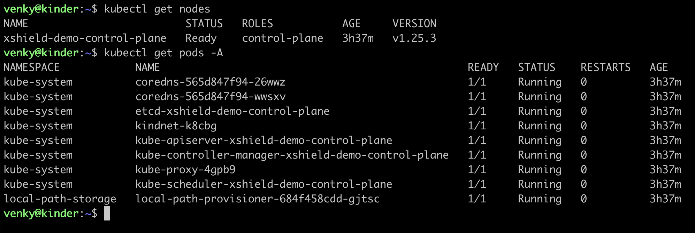
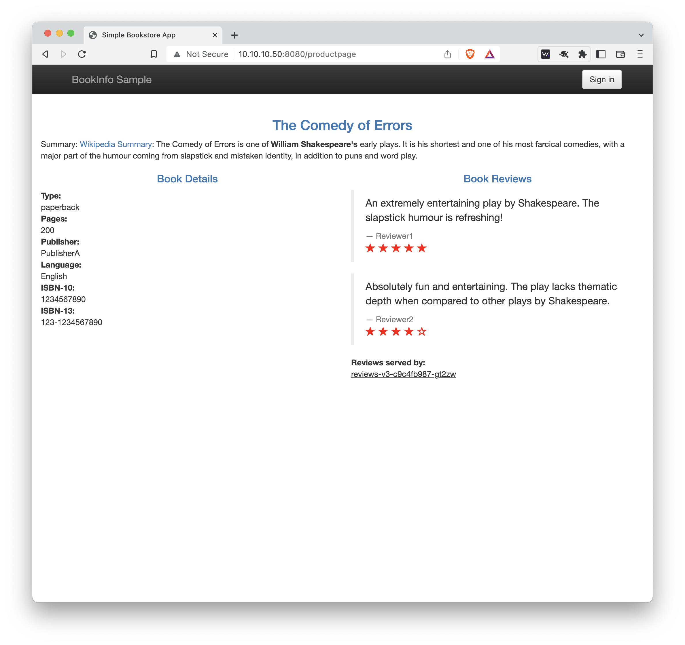

# k8s-istio-demo-lab
Deploy a single-VM demo lab for Xshield container security.  This demo lab uses Kubernetes-in-Docker (**kind**) to create a small K8s cluster, on which we run the **Istio** service mesh, and deploy a simple demo application provided by Istio.

<details><summary>Deploy an Ubuntu VM</summary>
<p>

The first step is deploying an Ubuntu VM, or you may use a physical machine running Ubuntu.  The recommended system configuration is:

* Minimum 4 vCPUs
* Minimum 8GB RAM
* 30GB Disk
* Ubuntu 22.04 LTS 

After the VM deploys, update as usual.
```
sudo apt update && sudo apt upgrade -y
```
</details>

<details><summary>Install Docker</summary>
<p>

Next, we install docker using the instructions from the Docker team.

```
sudo apt-get update
sudo apt-get install ca-certificates curl gnupg lsb-release
sudo mkdir -p /etc/apt/keyrings
curl -fsSL https://download.docker.com/linux/ubuntu/gpg | sudo gpg --dearmor -o /etc/apt/keyrings/docker.gpg
echo \
  "deb [arch=$(dpkg --print-architecture) signed-by=/etc/apt/keyrings/docker.gpg] https://download.docker.com/linux/ubuntu \
  $(lsb_release -cs) stable" | sudo tee /etc/apt/sources.list.d/docker.list > /dev/null
sudo apt-get update
sudo apt-get install docker-ce docker-ce-cli containerd.io docker-compose-plugin -y
```
These commands should complete without any errors. If you do run into issues please consult the Docker documentation.

To enable non-root access please complete the following steps.

```
sudo usermod -aG docker $USER
newgrp docker
```
> **Note**
If the docker group does not exist, run ***sudo groupadd docker***, before you run the ***usermod*** and ***newgrp*** commands.

Finally, you can test your docker installation by running:

```
docker run hello-world
```

Your output should look like this:


> **Warning** **Kind** *needs* docker, so proceed to the next step only after your docker installation is successful!

</p>
</details>

<details><summary>Install Kind</summary>
<p>

Installing **kind** is straightforward.

```
curl -Lo ./kind https://kind.sigs.k8s.io/dl/v0.17.0/kind-linux-amd64
chmod +x ./kind
sudo mv ./kind /usr/local/bin/kind
```

</p>
</details>

<details><summary>Create a K8s cluster</summary>  
<p>

It's time to create our cluster.

```
kind create cluster --name xshield-demo
```

Your output should resemble the following:


You can run these **kind** commands to check your cluster and the node(s)

```
kind get clusters
kind get nodes -n xshield-demo
```

Your output should look like this:


</p>
</details>

<details><summary>Install kubectl</summary>
<p>

You will also need **kubectl** to operate on your cluster.  Download the binary from the K8s repo:

```
curl -LO "https://dl.k8s.io/release/$(curl -L -s https://dl.k8s.io/release/stable.txt)/bin/linux/amd64/kubectl"
```

> **Note** To ensure you have the legitimate version of kubectl, verify its checksum as follows.  The output should be "kubectl: OK"
```
curl -LO "https://dl.k8s.io/$(curl -L -s https://dl.k8s.io/release/stable.txt)/bin/linux/amd64/kubectl.sha256"
echo "$(cat kubectl.sha256)  kubectl" | sha256sum --check
```

Now install it into your local bin directory:

```
sudo install -o root -g root -m 0755 kubectl /usr/local/bin/kubectl
```

You can now inspect your cluster using **kubectl**:

```
kubectl get nodes
kubectl get pods -A
```

Your output should resemble the following:



If all is well you can move on to installing Istio.

</p>
</details>

<details><summary>Install Istio</summary>
<p>

Download and install Istio as follows:

```
curl -L https://istio.io/downloadIstio | sh -
cd istio-1.16.0
export PATH=$PWD/bin:$PATH
istioctl install --set profile=demo -y
```

Your output should look like this:


To enable automatic Envoy sidecar proxy injection into our demo application, we add a label to the default namespace.

```
kubectl label namespace default istio-injection=enabled
```

</p>
</details>

<details><summary>Deploy the sample app</summary>
<p>
  
We are now ready to deploy the sample app provided by the Istio team.

```
kubectl apply -f samples/bookinfo/platform/kube/bookinfo.yaml
```

The output should look like this:


You can see the four services that comprise this application with the following command:
```
kubectl get services
```


It may take a few minutes for all the pods to come up along with their sidecar proxies. To check their status use **kubectl**:

```
kubectl get pods
```

Before proceeding to the next step ensure that all pods show 2/2 in the READY column as shown below:


To verify that the application is running in the cluster and serving web pages execute the following:

```
kubectl exec "$(kubectl get pod -l app=ratings -o jsonpath='{.items[0].metadata.name}')" -c ratings -- curl -sS productpage:9080/productpage | grep -o "<title>.*</title>"
```

You should see the following:


</p>
</details>

<details><summary>Enable external access</summary>
<p>

To enable access to the application from outside the cluster, we need to deploy an Istio ingress gateway:

```
kubectl apply -f samples/bookinfo/networking/bookinfo-gateway.yaml
```


Verify that there are no issues:

```
istioctl analyze
```


There is no built-in load balancer in Kind, and while you can setup a third party load balancer, there is no need to complicate things!  We can use **kubectl**'s *port forwarding* feature to access the ingress gateway from a remote browser:

```
kubectl port-forward --address  0.0.0.0 -n istio-system svc/istio-ingressgateway 8080:80
```

You can now access the application by pointing your browser at the following url:

*http://**vm-ip**:8080/productpage*



</p>
</details>
